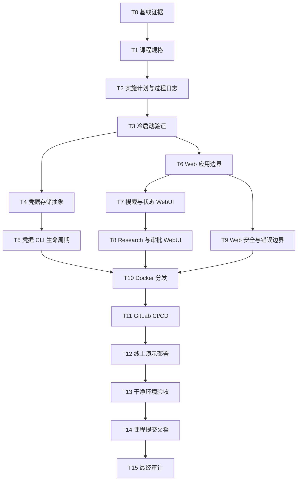

# Personal AI Knowledge Agent 课程完善实施计划

状态：已执行；T15 最终人工交付进行中
对应规格：`SPEC.md` + `SPEC_v2.md`
计划日期：2026-08-13  
基线 commit：`8b102d0ef76637037e4d1aef9640b47ac0a7a4b7`
当前发布：[`v0.1.1`](https://github.com/smwy-cj/Personal-AI-Knowledge-Agent/releases/tag/v0.1.1)，tag 对应 commit 以 GitHub Release 为准
最新自动验收：232 项测试全部通过；GitHub Actions 覆盖 Linux 3.9/3.11/3.13 和 Windows 3.11。

## 1. 执行原则

1. 初始阶段采用“旧文档只读、新建版本”的证据保护策略；2026-08-14 用户明确要求按完整项目统一完善所有 Markdown，当前活文档因此可以更新，历史证据和测试语料仍保持原样。
2. 每个实现任务先增加失败测试，再编写最小实现，最后重构并运行完整验证。
3. 每个独立实现模块使用独立分支和 PR；不得伪造过去不存在的 PR 或测试过程。
4. 离线测试不得调用真实付费 API、真实密钥环或真实个人 Vault。
5. Web、凭据和部署层必须复用现有 Application Service，不复制领域逻辑。
6. 每完成一个任务，应填写状态、commit hash、PR 链接和验证结果。
7. 若任务实际执行方式偏离本计划，应在新版本 PLAN 和 `AGENT_LOG.md` 中记录理由，不覆盖本文。

## 2. 状态标记

- `DONE`：已有客观证据证明完成。
- `IN PROGRESS`：正在执行，尚未满足全部验收标准。
- `TODO`：尚未开始。
- `BLOCKED`：存在明确外部阻塞，并记录阻塞原因。

## 3. 依赖关系总览



可并行关系：

- T4 与 T6 可在 T3 完成后并行。
- T7 与 T9 可在 T6 完成后并行，但若修改相同模板或应用入口，合并前需解决冲突。
- T5 可与 T7/T8 并行。
- T11 的 `unit-test` job 可提前准备，但镜像构建和部署 job 依赖 T10。
- T14 中的证据文档可随各任务持续新增，不应全部拖到最后。

## 4. 已完成的规划任务

### T0：固定当前工程基线

状态：`DONE`
依赖：无  
commit：待后续首次课程文档提交时填写  
涉及文件：

- 新增 `docs/course/TEST_EVIDENCE.md`

目标：记录课程完善开始前的代码、测试、CI、分发和安全事实。

已完成验证：

- `python scripts/verify.py` 返回 0；
- 23 个测试文件、149 项测试通过；
- 记录基线 commit `8b102d0ef76637037e4d1aef9640b47ac0a7a4b7`；
- 区分本地事实与尚未在线核验的 PR/CI/部署状态。

### T1：创建课程规格

状态：`DONE`
依赖：T0  
commit：待后续首次课程文档提交时填写  
涉及文件：

- 新增 `SPEC.md`

目标：从实际代码事实出发建立问题、用户、功能、安全、架构、数据、分发和验收规格。

已完成验证：

- 包含 9 个用户故事；
- 包含 10 个功能模块；
- 包含组件图和 Research 数据流；
- 明确当前是预定义计划的受治理确定性 Agent Workflow；
- WebUI、系统密钥环和正式分发均标记为待实现。

### T2：建立实施计划与过程日志

状态：`DONE`
依赖：T1  
涉及文件：

- 新增 `PLAN.md`
- 新增 `SPEC_PROCESS.md`
- 新增 `AGENT_LOG.md`

目标：把剩余工作拆成单次开发会话可执行的任务，并从现在开始保存真实过程证据。

验证步骤：

```powershell
rg -n '^### T[0-9]+' PLAN.md
rg -n '^## ' SPEC_PROCESS.md AGENT_LOG.md
git diff --name-only
git status --short
```

完成标准：所有 SPEC 验收项至少映射到一个任务；未执行事项不被标为完成。

## 5. 待执行任务

### T3：陌生智能体冷启动验证

状态：`DONE`
依赖：T2  
建议分支：`course/cold-start-validation`  
可并行：否；必须先于 T4/T6 正式实现

目标：验证陌生智能体是否仅凭 `SPEC.md` 与 `PLAN.md` 就能理解并实现任务。

涉及文件：

- 新增 `docs/course/COLD_START_VALIDATION.md`
- 若需修订规格，新建 `SPEC_v2.md`，不覆盖 `SPEC.md`
- 若需修订计划，新建 `PLAN_v2.md`，不覆盖 `PLAN.md`
- 追加 `SPEC_PROCESS.md` 或创建其新版本
- 追加 `AGENT_LOG.md` 或创建其新版本

执行步骤：

1. 使用与主开发智能体不同类型的全新会话。
2. 只提供 `SPEC.md` 与 `PLAN.md`，不提供历史对话或口头补充。
3. 指定它评审 T4 和 T6，并从中选择一个最小测试任务。
4. 明确要求遇到不确定之处立即停止提问。
5. 保存其问题、误读、实现选择和停止位置。
6. 判断问题源于规格歧义还是智能体误读。
7. 根据证据创建规格或计划新版本。

预期失败/反馈：

- Provider 凭据服务名、密钥优先级或 Web 身份验证边界可能不够明确；
- Web 框架尚未最终选择，智能体应停止而不是擅自决定；
- 公网演示的危险写操作策略需要明确。

验证步骤：

- 冷启动记录包含输入材料版本、智能体类型、开始/停止时间和所有澄清问题；
- 至少给出一项修订前后关键差异，或说明未发现阻塞歧义的证据；
- 不提交冷启动产生的试验代码，除非它经过正式 TDD 和评审流程。

完成标准：新会话可以无口头补充地解释项目边界，并能指出或安全处理不确定项。

### T4：实现凭据存储抽象

状态：`DONE`
依赖：T3  
建议分支：`feature/credential-store`  
可并行：可与 T6 并行

目标：增加可测试的凭据存储接口和系统密钥环实现，不改变现有 Provider 行为。

涉及文件：

- 新增 `src/personal_ai_agent/credentials.py`
- 新增 `tests/test_credentials.py`
- 新增 `docs/course/SECURITY_AND_CREDENTIALS.md`
- 可能新增运行依赖声明文件或在 `pyproject.toml` 增加依赖；若需保留原文件只读，则创建课程专用打包配置并在 PR 中说明限制

首先编写的失败测试：

1. fake store 能按 Provider 保存、覆盖、读取状态和删除。
2. status 结果不包含密钥值。
3. 不合法 Provider ID 被拒绝。
4. backend 不可用时安全失败且错误不含凭据。
5. 密钥值不进入 `repr`、日志或异常。

最小实现：

- 定义 `CredentialStore` 协议；
- 定义 `CredentialStatus`；
- 实现内存 fake；
- 实现 OS keyring adapter；
- 使用稳定 service name 和规范化 Provider ID；
- 不在本任务接入 CLI。

验证步骤：

```powershell
python -m unittest tests.test_credentials -v
python scripts/verify.py
```

完成标准：所有凭据单测和既有 149 项测试通过；真实操作系统密钥环不被测试修改。

### T5：实现凭据 CLI 生命周期与 Provider 解析

状态：`DONE`
依赖：T4  
建议分支：`feature/credential-cli`  
可并行：可与 T7/T8 并行

目标：提供隐藏录入、状态、更新和删除命令，并让 Provider 在调用时按规格解析凭据。

涉及文件：

- 修改 `src/personal_ai_agent/cli.py`
- 修改 `src/personal_ai_agent/application.py`
- 修改 `src/personal_ai_agent/provider_adapters.py`
- 修改或新增相关测试
- 新增 `docs/course/CREDENTIAL_CLI_GUIDE.md`

首先编写的失败测试：

1. `credential set` 使用可注入隐藏输入，不接受命令行明文值。
2. `credential status` 只显示 `configured` 和来源。
3. 重复 `set` 更新旧值。
4. `credential delete` 删除后 Provider 按后备规则解析环境变量。
5. 密钥环优先于环境变量。
6. 所有 stdout/stderr 均不包含标记密钥。

最小实现：

- 增加 `credential-set/status/delete` 子命令；
- 增加 Credential Resolver；
- Provider Adapter 接收 resolver，而非直接绑定 `os.environ`；
- 保留现有环境变量兼容路径。

验证步骤：

```powershell
python -m unittest tests.test_credentials tests.test_application_cli tests.test_provider_adapters -v
python scripts/verify.py
```

完成标准：SPEC 的 AC-06 全部满足；配置文件仍拒绝密钥字段。

### T6：建立 Web 应用边界与框架

状态：`DONE`
依赖：T3  
建议分支：`feature/web-foundation`  
可并行：可与 T4 并行

目标：选择轻量 Web 框架，并建立只调用 Application Service 的 Web 适配层。

涉及文件：

- 新增 `src/personal_ai_agent/web/` 包
- 新增 `tests/test_web_foundation.py`
- 新增 `docs/course/WEB_ARCHITECTURE.md`
- 新增课程专用依赖/打包说明

首先编写的失败测试：

1. `/health` 在无 Provider key 时返回成功且不执行付费调用。
2. 首页返回项目说明和核心入口。
3. Application Service 可以通过依赖注入替换为 fake。
4. 未知路径返回安全 404。
5. 未处理异常不显示堆栈或绝对路径。

最小实现：

- 创建应用工厂；
- 注入配置和 Application Service；
- 实现首页与健康检查；
- 建立模板、静态文件和统一错误响应；
- 固定开发/测试启动方式。

验证步骤：

```powershell
python -m unittest tests.test_web_foundation -v
python scripts/verify.py
```

完成标准：Web 层不直接访问 Provider、SQLite 细节或 Vault 文件；应用可在测试客户端中启动。

### T7：实现知识状态与搜索 WebUI

状态：`DONE`
依赖：T6  
建议分支：`feature/web-search`  
可并行：可与 T9 并行

目标：让用户通过浏览器查看示例知识库状态并执行带引用搜索。

涉及文件：

- 新增/修改 `src/personal_ai_agent/web/` 中路由、模板和样式
- 新增 `tests/test_web_search.py`
- 新增 `docs/course/WEB_SEARCH_ACCEPTANCE.md`

首先编写的失败测试：

1. 空查询显示用户可理解的校验错误。
2. 正常查询展示路径、行号、匹配方法和安全转义后的摘要。
3. 标签和路径过滤正确传递给 Application Service。
4. 笔记正文中的 HTML/脚本不会作为页面脚本执行。
5. Provider 不可用时关键词搜索仍可使用。

最小实现：

- 知识库状态卡片；
- 搜索表单；
- 结果列表和来源定位；
- 查询/分页边界；
- 明确区分关键词与混合检索。

验证步骤：

```powershell
python -m unittest tests.test_web_search -v
python scripts/verify.py
```

完成标准：使用固定示例 Vault 能通过浏览器找到三篇示例笔记并查看来源。

### T8：实现 Research、Task 与 Memory 审批 WebUI

状态：`DONE`
依赖：T7  
建议分支：`feature/web-research-memory`  
可并行：否

目标：形成课程演示的核心闭环。

涉及文件：

- 新增/修改 Web 路由与模板
- 新增 `tests/test_web_research.py`
- 新增 `tests/test_web_memory.py`
- 新增 `docs/course/DEMO_GUIDE.md`

首先编写的失败测试：

1. 空研究目标被拒绝。
2. fake Provider 任务能展示状态、摘要和引用。
3. WAITING_USER 页面展示所有待审候选。
4. 审批提交必须为每个候选给出批准或拒绝。
5. 重复提交不会重复写入记忆。
6. 取消操作显示最终或已请求状态。

最小实现：

- Research 提交页面；
- Task 状态详情；
- 取消按钮；
- Memory 候选审批表单；
- 摘要与引用展示；
- 演示模式 fake Provider。

验证步骤：

```powershell
python -m unittest tests.test_web_research tests.test_web_memory -v
python scripts/verify.py
```

完成标准：从提交 Research 到审批并查看写回收据的完整浏览器流程可重复演示。

### T9：Web 安全、可访问性与错误边界

状态：`DONE`
依赖：T6  
建议分支：`feature/web-security`  
可并行：可与 T7 并行，合并前需在 T8 上回归

目标：建立公网演示最低安全边界。

涉及文件：

- 修改 Web 中间件、模板和配置
- 新增 `tests/test_web_security.py`
- 新增 `docs/course/WEB_SECURITY.md`

首先编写的失败测试：

1. 状态改变请求缺失/错误 CSRF token 时拒绝。
2. 响应包含 CSP、`X-Content-Type-Options`、Referrer Policy 等安全头。
3. Cookie 使用安全属性（按 HTTPS 环境配置）。
4. 错误页面不包含堆栈、绝对路径、Prompt、Provider 正文或 key。
5. 公网演示模式禁用凭据写入和非演示目录写操作。
6. 核心表单可通过键盘和标签访问。

最小实现：

- CSRF；
- 安全 headers；
- 请求大小和字段长度限制；
- 统一关联 ID 错误页；
- 演示模式写入限制；
- 基础可访问性修正。

验证步骤：

```powershell
python -m unittest tests.test_web_security -v
python scripts/verify.py
```

完成标准：SPEC AC-07 和 AC-10 中 Web 相关条目满足。

### T10：Docker 与 Python 包分发

状态：`DONE`
依赖：T5、T8、T9  
建议分支：`delivery/container-package`  
可并行：否

目标：提供在干净环境可重复构建和启动的主分发产物。

涉及文件：

- 新增 `Dockerfile`
- 新增 `.dockerignore`
- 新增 `docker-compose.example.yml`
- 新增 `.env.example`（只含变量名与假值，不含真实 key）
- 新增 `LICENSE`
- 新增 `docs/course/DISTRIBUTION_AND_DEPLOYMENT.md`
- 新增 `tests/test_distribution_contract.py`
- 可能新增课程专用包元数据文件

首先编写的失败测试：

1. 构建上下文排除 `.git`、`data`、缓存、真实配置和本地 Vault。
2. 示例环境文件不含疑似真实凭据。
3. 容器以非 root 用户运行。
4. `/health` 在无真实 key 环境可用。
5. 安装构建产物后 CLI 与 Web 启动入口存在。

最小实现：

- 多阶段或精简镜像；
- 非 root 用户；
- 固定工作目录和挂载点；
- 健康检查；
- 示例配置与 Vault；
- wheel/sdist 构建。

验证步骤：

```powershell
python -m build
python -m unittest tests.test_distribution_contract -v
docker build -t personal-ai-knowledge-agent:course .
docker run --rm personal-ai-knowledge-agent:course personal-ai-agent --help
python scripts/verify.py
```

完成标准：无真实 key 可以构建；使用演示配置可以启动 WebUI；镜像中无开发者数据。

### T11：GitLab CI/CD

状态：`DONE`
依赖：T10  
建议分支：`delivery/gitlab-ci`  
可并行：否

目标：满足课程指定 GitLab 流水线并生成可核验证据。

涉及文件：

- 新增 `.gitlab-ci.yml`
- 新增 `docs/course/CI_CD_EVIDENCE.md`
- 可能新增 CI 辅助脚本

首先验证的失败状态：

- 在添加配置前，仓库不存在 `.gitlab-ci.yml` 和 `unit-test` job；
- 首次提交后记录实际流水线问题，不伪造通过状态。

最小实现：

- `unit-test`：安装并运行 `python scripts/verify.py`；
- `package-build`：构建 wheel/sdist 并保存 artifact；
- `container-build`：构建镜像；
- 缓存不包含密钥或运行数据库；
- 部署 job 仅在受保护条件下执行。

验证步骤：

```powershell
rg -n '^unit-test:' .gitlab-ci.yml
```

远程验证：

- 推送 NJU Git/GitLab；
- 记录流水线 URL、commit SHA、各 job 状态；
- 最后一次流水线必须通过。

完成标准：SPEC AC-09 满足。

### T12：部署公开演示环境

状态：`DONE（采用教师确认的 GitHub Release 替代路线）`
依赖：T11  
建议分支：`delivery/demo-deployment`  
可并行：否

目标：提供截止日期前可访问的 HTTPS WebUI。

涉及文件：

- 新增平台部署配置
- 新增 `docs/course/DEPLOYMENT_EVIDENCE.md`
- 更新只能通过新建 `README_COURSE.md` 完成

首先验证的失败状态：

- 当前没有公开 URL；
- 目标平台若未配置健康检查、持久卷或演示模式，部署不得宣称完成。

实施要求：

- 使用脱敏示例 Vault；
- 启用演示安全模式；
- 不把真实 key 写入镜像或仓库；
- 免费额度无法支持真实模型时使用明确标注的 fake Provider 演示；
- 危险写操作限制在临时演示目录。

验证步骤：

- HTTPS 首页返回 200；
- `/health` 返回成功；
- 搜索闭环可用；
- fake Research 与审批闭环可用；
- 页面和响应不泄漏平台环境变量、绝对路径或个人数据。

完成标准：SPEC AC-07 的公网要求满足，并记录可点击 URL 和验证日期。

### T13：干净环境与安全验收

状态：`DONE`
依赖：T12  
建议分支：`delivery/clean-machine-verification`  
可并行：否

目标：证明项目不依赖开发者机器隐式状态。

涉及文件：

- 新增 `docs/course/CLEAN_MACHINE_VERIFICATION.md`
- 新增 `docs/course/SECRET_SCAN_EVIDENCE.md`

验证内容：

1. 全新临时目录获取源码。
2. 按文档构建 Python 包和 Docker 镜像。
3. 无 key 运行离线测试与示例 WebUI。
4. 使用测试凭据验证隐藏录入和删除，不保留测试 secret。
5. 扫描当前树和 Git 历史中的疑似密钥。
6. 检查容器文件系统不含本地 Vault、数据库和配置。
7. 记录操作系统、架构、Python、Docker 版本和所有命令结果。

完成标准：SPEC AC-01、AC-06、AC-08 和 AC-10 在独立环境得到证据支持。

### T14：课程提交文档与演示材料

状态：`DONE`
依赖：T13  
建议分支：`docs/course-submission`  
可并行：部分证据材料可随实现同步新增

目标：为助教提供单一路径验收项目，同时保留原 README 不变。

涉及文件：

- 新增 `README_COURSE.md`
- 新增 `docs/course/ARCHITECTURE.md`
- 新增 `docs/course/PR_AND_REVIEW_EVIDENCE.md`
- 新增 `docs/course/DEMO_GUIDE.md` 或其新版本
- 新增 `REFLECTION_GUIDE.md`
- 根据真实过程补充 `SPEC_PROCESS.md`、`AGENT_LOG.md` 或创建新版本

首先验证的失败状态：

- 所有链接、命令、URL 和 commit 在写入前逐一验证；
- 不把计划中的地址写成已发布地址。

验证步骤：

```powershell
python scripts/verify.py
rg -n 'TODO|待填写|待验证' README_COURSE.md docs/course
```

人工验证：

- 按 README_COURSE 从零完成一次安装、运行、测试和演示；
- 检查第三方依赖和许可证；
- 学生本人根据 `REFLECTION_GUIDE.md` 撰写 `REFLECTION.md`。

完成标准：SPEC AC-11、AC-12 满足；原 README 和原历史文档未被修改。

### T15：最终审计与提交冻结

状态：`IN PROGRESS`
依赖：T14  
建议分支：`release/course-final`  
可并行：否

目标：对最终提交 commit 做一次独立、可重复的验收。

涉及文件：

- 新增 `docs/course/FINAL_ACCEPTANCE.md`
- 如发现问题，修复代码并创建新的证据文档版本

审计清单：

1. 全部离线测试通过。
2. GitLab 最新流水线通过且对应最终 commit。
3. 公开 WebUI URL 可访问。
4. Docker/包发行地址可访问。
5. 课程指定文档齐全。
6. `REFLECTION.md` 为学生本人内容。
7. Git 当前树与历史无真实凭据。
8. 所有 PR、commit、人工修改和验证记录可追溯。
9. 原有文档未被修改。
10. 已知限制与演示模式如实说明。

完成标准：所有硬性要求有“文件、命令结果或远程 URL”之一作为客观证据；不存在只靠口头声明的完成项。

## 6. 验收项到任务映射

| SPEC 验收项 | 对应任务 |
|---|---|
| AC-01 离线验证 | T0、T4 至 T13、T15 |
| AC-02 同步与搜索 | T7、T13 |
| AC-03 Research 与引用 | T8、T13 |
| AC-04 Memory 审批 | T8、T13 |
| AC-05 执行治理 | 既有基线、T13、T15 |
| AC-06 凭据生命周期 | T4、T5、T13 |
| AC-07 WebUI | T6 至 T9、T12 |
| AC-08 分发 | T10、T13 |
| AC-09 CI/CD | T11、T15 |
| AC-10 安全 | T4、T5、T9、T10、T13、T15 |
| AC-11 课程文档 | T0 至 T3、T14 |
| AC-12 仓库与评审 | T3 至 T15 |

## 7. 暂不实施范围

以下内容不进入当前课程完善路线，除非测试证明它们阻塞验收：

- 动态 Planner 和通用 Replan；
- 多 Agent 并行执行；
- 新增更多 Provider；
- 供应商专有账单解析；
- 大规模多租户认证与授权；
- 移动端客户端；
- 与课程验收无直接关系的新质量指标。
