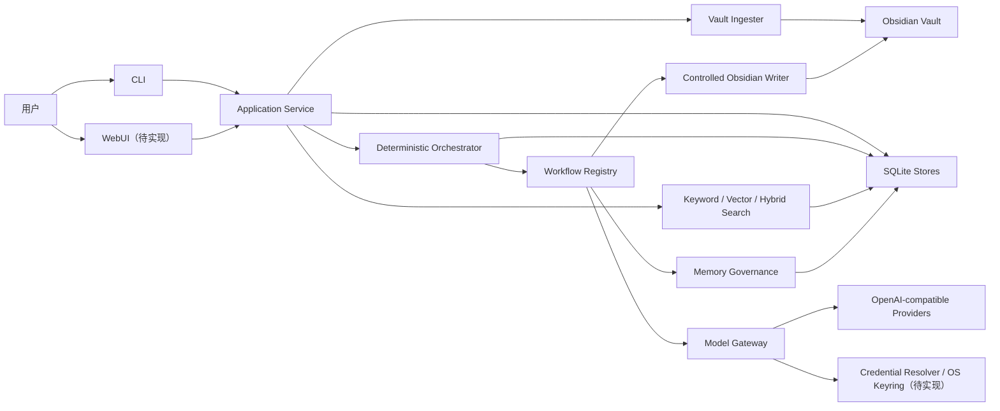
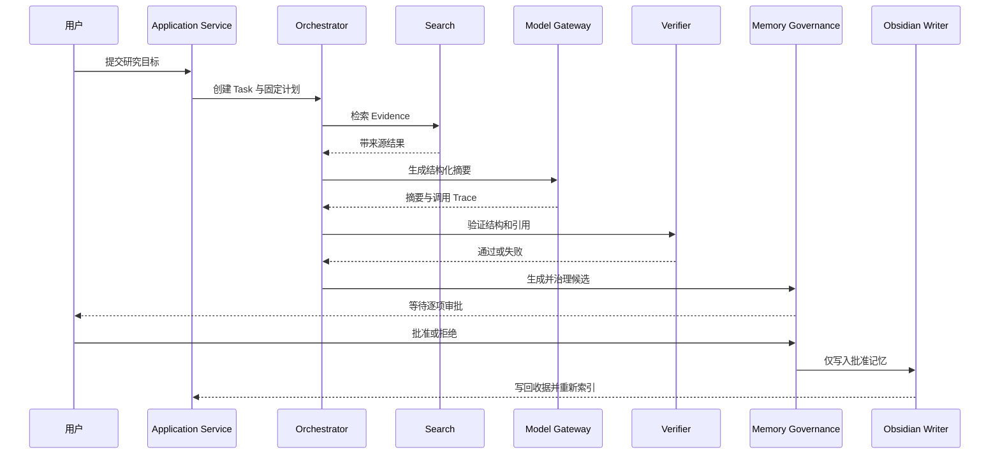

# Personal AI Knowledge Agent 课程项目规格

状态：已接受并实现于 `v0.1.0`；凭据、Web 与部署边界的后续澄清以 `SPEC_v2.md` 为准
适用方向：AI4SE B 类应用项目（包含受治理 Agent Workflow）  
基线 commit：`8b102d0ef76637037e4d1aef9640b47ac0a7a4b7`  
规格日期：2026-08-13

## 1. 问题陈述

### 1.1 要解决的问题

长期使用 Obsidian 的用户往往积累大量 Markdown 笔记，但传统全文检索难以完成跨笔记研究、证据组合和可追溯总结。直接把笔记发送给通用聊天模型又会产生四类风险：

1. 回答缺少可以回查到文件和行号的来源；
2. 模型可能把错误结论写入长期记忆；
3. 私人数据可能被发送给不符合隐私要求的 Provider；
4. 长任务的成本、重试、取消和失败恢复不可控。

本项目构建一个本地优先、证据可追溯、记忆写入受治理的个人知识智能体。它将 Obsidian Vault 摄取为本地索引，执行关键词或混合检索，生成带引用的研究摘要，对引用进行确定性验证，并且只在用户明确审批后保存长期记忆和写回受控目录。

### 1.2 目标用户

- 使用 Obsidian 维护课程、研究或项目笔记的学生与研究者；
- 需要从个人资料中快速形成可核查研究摘要的知识工作者；
- 重视本地数据、Provider 隐私边界和模型成本控制的技术用户。

### 1.3 为什么值得做

项目提供的价值不是“又一个聊天界面”，而是把个人知识问答变成一条可审计的工程链路：来源可定位、结果可验证、记忆可审批、任务可恢复、成本可度量。用户可以快速得到答案，同时保留判断模型是否引用正确、是否应该长期保存结论的控制权。

### 1.4 非目标

- 不构建通用 Coding Agent Harness；
- 不构建完全自主、无限循环的通用 Agent；
- 不代替 Obsidian 本身的编辑和同步功能；
- 不自动把所有模型输出写入长期记忆；
- 不承诺对任意 Provider 的专有配额和账单格式自动兼容；
- 不以多 Agent 数量作为项目深度指标；
- 不在课程版本中上传或展示真实个人 Vault。

## 2. 项目范围与状态

### 2.1 已实现基线

- Obsidian Markdown 增量摄取；
- 关键词、向量和混合检索；
- 带来源定位的 Evidence；
- 五步 Research Workflow；
- 结构化摘要与引用验证；
- Memory Candidate 治理、人工审批和受控写回；
- Task 状态、预算、重试、Checkpoint、恢复、租约和取消；
- Provider 能力/隐私/成本路由；
- Provider 请求、Token 和并发治理；
- 脱敏观测、成本报告、账单对账和质量门禁；
- CLI 和 149 项本地通过的自动化测试。

### 2.2 课程提交前必须新增

- 系统密钥环和完整凭据生命周期；
- 最小 WebUI；
- 公开在线演示；
- Docker 或正式包管理器分发；
- GitLab CI/CD；
- 课程过程文档和可核验工程证据。

## 3. 用户故事

### US-01：同步个人知识库

作为 Obsidian 用户，我希望同步指定 Vault 的 Markdown 笔记，以便系统的检索结果反映当前文件内容，而无需每次完整重建索引。

验收重点：新增、修改、删除和未变化文件被区分；单个文件失败不会静默伪装为成功。

### US-02：执行可追溯搜索

作为研究者，我希望使用关键词或混合检索搜索笔记，并看到文件、Chunk 和行号，以便回到原文核查上下文。

验收重点：查询有数量边界；过滤条件生效；每条结果保留稳定来源定位。

### US-03：生成带引用研究摘要

作为学生，我希望输入研究目标并获得结构化、带引用的摘要，以便快速整合多篇笔记，同时知道每个关键结论来自哪里。

验收重点：无证据时不生成伪造结论；未知、过期或被篡改引用导致验证失败。

### US-04：审批长期记忆

作为知识库所有者，我希望在新结论写入长期记忆前逐项批准或拒绝，以便敏感、重复、冲突或错误内容不会自动污染知识库。

验收重点：所有待审候选都必须得到明确决定；敏感候选自动拒绝；拒绝不产生写入。

### US-05：安全管理 Provider 凭据

作为用户，我希望通过隐藏输入保存、更新、检查和清除 Provider key，以便无需把密钥写入配置文件或命令历史。

验收重点：系统密钥环持久化；状态查询不回显明文；日志和错误不包含 key。

### US-06：查看和取消长任务

作为用户，我希望查看 Research 任务状态并请求取消，以便失控、耗时或不再需要的任务能够在安全边界停止。

验收重点：任务状态持久化；取消请求跨进程可见；任务在步骤、退避等待或网络调用前后边界收敛。

### US-07：通过 WebUI 完成核心闭环

作为首次接触项目的助教或用户，我希望通过浏览器同步示例知识、搜索、运行研究并审批记忆，以便无需学习全部 CLI 即可理解和验证项目价值。

验收重点：公网可访问；示例数据脱敏；关键流程可在界面中完成；错误不泄露内部信息。

### US-08：审计质量、延迟和成本

作为项目维护者，我希望查看脱敏运行摘要并运行离线质量门禁，以便在不保存用户正文的情况下发现质量退化、延迟异常或成本上升。

验收重点：报告只包含白名单字段；门禁失败和配置错误使用不同退出码。

### US-09：在全新环境部署

作为助教，我希望使用文档中的固定命令构建、测试和启动项目，以便证明交付物不依赖开发者机器的隐式状态。

验收重点：无真实 key 也能构建和运行离线演示；运行时数据通过明确挂载或平台存储保存。

## 4. 功能规格

### 4.1 模块 A：Vault 摄取

输入：Vault 路径、Markdown 文件和无密钥配置。  
行为：解析 Frontmatter、标题、标签、Wiki Link 和行号；以稳定 ID 增量同步。  
输出：新增、更新、删除、未变化和失败数量；本地知识索引。  
边界：只处理受支持的 Markdown；运行时数据库不得位于 Vault 内；不得读取 Obsidian 内部目录作为受控写回目标。  
错误：无效路径、危险目录或解析失败返回明确错误；失败不得导致未声明的数据删除。

### 4.2 模块 B：关键词、向量和混合检索

输入：非空查询、结果数、可选路径/标签过滤、可选 Embedding Provider。  
行为：关键词检索使用 FTS5 或确定性回退；向量检索使用版本化缓存；混合检索使用加权 RRF。  
输出：按相关度排列的结果及 Vault、相对路径、Chunk、行号、内容哈希和匹配方式。  
边界：限制空查询、过长查询和结果数；向量维度或 Provider 版本变化使旧缓存失效。  
错误：缺失 Provider、非法向量、维度不一致或远程错误不得返回看似正常的伪结果。

### 4.3 模块 C：Research Workflow

输入：研究目标、Thread ID、语言、结果数和可选 Provider。  
行为：按固定依赖执行 `retrieve → summarize → propose → persist → writeback`；在 Memory 审批处暂停。  
输出：Research 摘要、Evidence、模型调用记录、Memory Candidate、Task 状态和最终写回收据。  
边界：遵守工具、模型、Token 和重试预算；无检索证据不调用模型生成虚构答案。  
错误：确定性配置/验证错误不重试；可重试 Provider 错误有限退避；预算耗尽、取消和失败产生明确终态。

### 4.4 模块 D：引用验证

输入：摘要引用和检索时保存的 Evidence。  
行为：回查当前知识索引，比较来源位置和内容哈希，并验证摘要结构。  
输出：验证通过或具体失败类型。  
边界：引用必须属于本次 Evidence；旧索引产生的引用在来源变化后不得继续被接受。  
错误：未知引用、篡改 Evidence、来源漂移、无引用段落均失败。

### 4.5 模块 E：Memory Governance 与写回

输入：已验证摘要产生的候选、已有记忆和用户审批决定。  
行为：检查来源、敏感信息、重复和冲突；等待用户逐项批准/拒绝；只持久化批准项；原子写入受控 Obsidian 目录并重新索引。  
输出：候选治理状态、持久化记忆、写回文件和收据。  
边界：用户编辑后的托管文件视为漂移，不自动覆盖；非托管同名文件不得覆盖；路径必须留在受控目录。  
错误：缺失审批、未知候选、审批集合不完整、路径穿越和内容漂移均明确失败。

### 4.6 模块 F：任务执行控制

输入：结构化 Plan、Task Budget、取消请求。  
行为：验证依赖图；执行就绪步骤；保存 Checkpoint；用 SQLite 租约避免多个执行者同时推进同一任务；支持过期接管。  
输出：Task Snapshot、Checkpoint 历史、状态转换、错误记录和脱敏事件。  
边界：循环依赖拒绝；步骤重试有限；旧 owner 丧失租约后不得写入。  
错误：预算耗尽、租约冲突、取消和未知 Workflow 使用独立错误语义。

### 4.7 模块 G：Provider Gateway 与资源治理

输入：模型请求、Provider Profile、能力/隐私/上下文/成本约束。  
行为：选择符合约束的 Provider；执行有限 fallback；治理请求、Token、并发、动态冷却和 Usage 校正。  
输出：结构化模型响应、调用 Trace、估算成本和脱敏配额事件。  
边界：带凭据远程请求只允许 HTTPS；不读取错误响应正文作为持久化内容；同步 HTTP 只能通过 timeout 和调用边界取消。  
错误：能力不匹配、预算不足、缺失凭据、响应 Schema 错误和超限均明确失败。

### 4.8 模块 H：凭据管理（待实现）

输入：Provider ID 和隐藏输入的凭据。  
行为：写入系统密钥环；支持覆盖更新、状态查询和删除；Provider 调用时解析凭据。  
输出：不含明文的操作结果，包括 Provider、是否存在和凭据来源。  
边界：测试必须使用 fake backend；环境变量仅作为显式后备；配置文件只保存逻辑引用。  
错误：密钥环不可用、权限不足或 Provider 不存在时安全失败，错误不包含输入值。

### 4.9 模块 I：WebUI（待实现）

输入：浏览器表单和 Web API 请求。  
行为：复用 Application Service 完成状态查看、搜索、Research、Task 查看/取消、Memory 审批和运行摘要。  
输出：服务器渲染页面或受约束 JSON API。  
边界：前端不直连 Provider；不在浏览器持久化 key；线上环境只使用脱敏示例 Vault；写操作必须显式确认。  
错误：用户错误返回安全提示；服务器错误返回关联 ID，不返回堆栈、绝对路径、Prompt 或 Provider 正文。

### 4.10 模块 J：评测与观测

输入：版本化评测集、质量基线、阈值和脱敏事件。  
行为：计算检索、Research、Memory、运行质量、成本和账单差异指标。  
输出：机器可读 JSON 报告；通过为 0，质量未达标为 3，配置/执行错误为 2。  
边界：报告不复制查询、笔记、Prompt、证据或回答正文；候选基线必须待人工审查。  
错误：作用域不一致、未知指标、NaN/Infinity、非法账单结构均拒绝。

## 5. 非功能需求

### 5.1 性能

- 固定小型示例语料的一键离线验证应在普通开发机 60 秒内完成；该目标不包含镜像首次下载和真实 Provider 网络延迟。
- CLI/Web 搜索在固定示例语料上的 P95 目标为 250 ms。
- Web 健康检查在应用进程正常且本地数据库可用时目标为 1 秒内响应。
- Provider 调用必须有显式 timeout，不能无限等待。

### 5.2 安全

- 真实凭据不得进入源代码、Git、配置文件、日志、事件、错误正文或演示截图。
- 默认安全存储为操作系统密钥环；环境变量是兼容后备且必须说明风险。
- Provider URL 不允许嵌入凭据、query 或 fragment。
- 带凭据的远程 Provider 必须使用 HTTPS。
- WebUI 使用同源策略、CSRF 防护、安全 Cookie 和基本安全响应头。
- 所有文件写入必须经过路径规范化和受控目录校验。
- 线上演示不得挂载真实个人 Vault。

### 5.3 可用性

- 陌生用户应在首页 30 秒内理解项目用途。
- CLI 和 WebUI 的核心概念、状态名称与错误语义保持一致。
- 高风险动作包含清晰确认和结果反馈。
- 状态查询不得要求用户理解数据库内部结构。

### 5.4 可靠性

- Task 在关键步骤保存 Checkpoint，进程重启后能恢复且跳过已完成步骤。
- 同一 Task 同时只能有一个有效执行 owner。
- 重试、模型调用、工具调用和 Token 使用均有硬上限。
- 写回使用原子操作并检测用户修改漂移。

### 5.5 可观测性

- 记录任务和步骤生命周期、次数、Token、估算成本和延迟等白名单指标。
- 不记录用户目标、Prompt、查询、笔记、回答、HTTP 头或 Provider 正文。
- 支持按保留期预览和显式清理事件。

### 5.6 可移植性与可维护性

- 核心运行时支持 Python 3.9+。
- 离线测试不需要真实 Provider key 或网络。
- 课程主分发形态使用 Docker；Python 包作为辅助形态。
- Web 层只适配应用服务，不复制领域逻辑。

## 6. 凭据威胁模型与对策

| 威胁 | 风险 | 对策 |
|---|---|---|
| key 写入配置并提交 | 仓库永久泄漏 | 配置 Schema 拒绝密钥字段；示例只写凭据引用 |
| 命令行参数录入 key | Shell history 泄漏 | 使用隐藏交互输入，不接受明文 key 参数 |
| 日志或异常回显 | CI/终端泄漏 | 错误白名单；不拼接 key；回归测试使用标记值 |
| 浏览器保存 key | LocalStorage/表单历史泄漏 | 浏览器不持久化；优先由服务器 CLI/安全设置流程录入 |
| HTTP 传输 | 中间人窃取 | 带凭据远程 Provider 强制 HTTPS |
| Provider 响应正文进入日志 | 敏感内容泄漏 | 错误不持久化响应正文 |
| 密钥环不可用时静默降级 | 误以为已安全保存 | 明确失败或要求用户显式选择环境变量后备 |
| 演示环境使用个人数据 | 隐私泄漏 | 仅部署固定脱敏示例 Vault |
| Git 历史遗留密钥 | 删除工作树文件仍可恢复 | 提交前扫描完整历史；发现真实 key 必须撤销并清理历史 |

凭据优先级暂定：系统密钥环优先，其次是配置声明的环境变量。该规则须在实现测试中固定；若后续安全评审决定禁止同时配置，则创建新版本规格记录变更。

## 7. 系统架构

### 7.1 组件图

### 7.2 Research 数据流

### 7.3 Agent 边界

本项目的 Agent 部分由结构化 Task、状态机、固定 Plan、Workflow Registry、工具/模型调用、验证、反馈、暂停和恢复构成。当前 Research 计划由应用代码预定义，模型不自由生成计划，也不在开放工具集中自主选择任意工具。

因此课程版本称为“受治理的确定性 Agent Workflow”，不称为通用自主 Agent。项目自研边界包括：

- Orchestrator 主循环；
- Workflow 注册与执行；
- 状态转换；
- 依赖调度；
- 预算、重试和停止条件；
- Checkpoint 和恢复；
- 租约与取消；
- 引用验证；
- Memory 治理与人工审批。

移除真实 LLM 后，上述机制仍通过 fake workflow、fake Provider 和固定评测语料进行确定性测试。

## 8. 数据模型

### 8.1 Task

关键字段：`task_id`、`thread_id`、`user_goal`、`status`、`plan`、`current_step_id`、`budget`、`tool_calls`、`model_calls`、`token_usage`、`errors`、`memory_candidates`、`awaiting_user_approval`、时间戳。  
约束：状态转换必须合法；预算非负；Task ID 唯一；终态不可继续执行。

### 8.2 PlanStep

关键字段：`step_id`、`kind`、`executor`、`inputs`、`depends_on`、`status`、`attempt_count`。  
约束：同一计划 Step ID 唯一；依赖存在且无环；只有依赖完成的步骤可执行。

### 8.3 Knowledge Document 与 Chunk

关键字段：Vault ID、相对路径、内容哈希、标题层级、标签、链接、起止行号和正文。  
约束：来源定位稳定；文件变化后旧 Chunk 不得继续被视为当前证据。

### 8.4 Evidence

关键字段：`source_id`、`vault_id`、`relative_path`、`chunk_id`、`start_line`、`end_line`、`content_hash`。  
约束：引用必须能回查当前索引；摘要不得引用 Evidence 集合外来源。

### 8.5 MemoryCandidate 与 MemoryRecord

关键字段：候选 ID、类型、主题、内容、来源 ID、置信度、治理状态、冲突 ID、决定原因。  
约束：敏感候选拒绝；待审候选必须逐项决定；只有批准候选可以持久化和写回。

### 8.6 Provider Profile

关键字段：Provider ID、URL、模型、凭据引用、能力、上下文上限、成本等级、隐私上限、优先级、请求/Token/并发限制和价格。  
约束：Provider ID 唯一；凭据值不进入配置；受凭据保护的远程 URL 必须是 HTTPS。

### 8.7 Event

关键字段：事件类型、任务/步骤 ID、时间和白名单数值属性。  
约束：不得包含用户正文、Prompt、查询、Evidence、回答、HTTP 头、绝对冷却时间或凭据。

## 9. 技术选型

- Python 3.9+：与现有标准库实现一致，降低离线运行和打包依赖。
- SQLite：适合单用户、本地优先、可事务恢复的桌面/个人工具；不声称支持大规模多租户。
- Obsidian Markdown：保留用户已有知识资产和文件所有权。
- OpenAI-compatible HTTP Adapter：提供通用模型/Embedding 接入边界，但不假设所有供应商行为相同。
- 确定性 Orchestrator：使预算、重试、验证和恢复可以脱离真实模型单测。
- 轻量 Python Web 框架（待实现时最终确认）：复用 Application Service，避免独立前端构建链扩大范围。
- Docker：作为课程主分发形态，统一 WebUI、Python 和运行目录边界。
- GitLab CI：满足课程指定 `unit-test` job 和最终流水线要求。

UI 设计不依赖 Open Design 作为硬性条件；课程材料会说明采用简洁、可访问、面向任务闭环的自有界面规范。

## 10. 分发与部署设计

### 10.1 主分发：Docker

- 单条构建命令生成镜像；
- 单条运行命令启动 WebUI；
- 镜像使用非 root 用户；
- Vault、SQLite 数据和配置使用明确挂载点；
- 构建阶段不需要真实 key；
- 健康检查不调用付费 Provider；
- 演示镜像只包含脱敏固定语料；
- 镜像发布到公开 registry，使用版本号和 commit 标签。

### 10.2 辅助分发：Python 包

- 构建 wheel 和 sdist；
- 安装后提供 `personal-ai-agent`；
- README_COURSE 说明 Python 版本、平台限制和安装命令；
- 补充 LICENSE 和包元数据。

### 10.3 线上部署

- 提供截止日期前可访问的 HTTPS URL；
- 使用脱敏示例 Vault；
- 不在镜像或仓库保存 key；
- 免费额度不足时应以明确的离线演示模式降级，而不是泄漏个人凭据；
- 部署平台和 CI/CD 流程记录在新文档中。

## 11. 验收标准

### AC-01：离线验证

在无 Provider key 和无网络调用条件下，`python scripts/verify.py` 返回 0，原 149 项测试和后续新增离线测试全部通过。

### AC-02：知识同步与搜索

使用固定示例 Vault 同步后，WebUI 和 CLI 均能搜索到带文件、Chunk 和行号的结果；修改或删除文件后再次同步会更新索引。

### AC-03：Research 与引用

使用 fake Provider 运行 Research 能生成结构化摘要和引用；篡改引用或修改来源后验证失败；无 Evidence 时不生成摘要。

### AC-04：Memory 审批

任务在候选需要审批时进入 `WAITING_USER`；所有候选明确批准/拒绝后才继续；仅批准项进入 Memory Store 和受控 Vault 目录。

### AC-05：执行治理

循环计划被拒绝；工具、模型、Token 和重试预算生效；同一 Task 不能被两个有效 owner 同时推进；取消请求最终产生 `CANCELLED`。

### AC-06：凭据生命周期

用户能隐藏录入、覆盖更新、查询状态和删除 Provider key；状态、日志、错误、测试和 Web 页面均不显示明文；fake keyring 测试全部通过。

### AC-07：WebUI

公网 HTTPS URL 可访问；首页在 30 秒内说明用途；用户能完成搜索、Research 状态查看和 Memory 审批；线上数据为脱敏示例。

### AC-08：分发

在干净环境中按照 `README_COURSE.md` 构建并运行 Docker 镜像；健康检查通过；镜像中不含开发者 Vault、数据库、缓存或真实 key。

### AC-09：CI/CD

根目录存在 `.gitlab-ci.yml`，包含准确命名为 `unit-test` 的 job；最后提交对应的流水线为通过状态；测试不调用真实付费 API。

### AC-10：安全

当前树和完整 Git 历史未发现真实凭据；配置拒绝密钥字段；Web 错误不显示堆栈、绝对路径、Prompt 或 Provider 正文；所有写入均受目录边界保护。

### AC-11：课程文档

`SPEC.md`、`PLAN.md`、`SPEC_PROCESS.md`、`AGENT_LOG.md`、`README_COURSE.md` 和相关证据文档齐全；最终 `REFLECTION.md` 由学生本人完成并如实标注 AI 润色情况。

### AC-12：仓库与评审

后续独立整改模块通过独立分支和 PR 完成；PR 标注 AI 产出、人工修改、规格检查、代码质量检查和测试证据；不存在伪造历史过程。

## 12. 风险与未决问题

| 风险/问题 | 当前处理 |
|---|---|
| 真实 Provider 不返回完整 Usage | 保留估算并标记缺失，不伪装为零成本 |
| 同步 HTTP 无法在 socket 内立即取消 | 使用 timeout，并在调用前后与退避期检查取消 |
| SQLite 不适合大规模多租户 | 产品定位为单用户/小规模个人部署 |
| WebUI 扩大攻击面 | 最小化 API、同源、CSRF、安全 headers、脱敏错误 |
| 密钥环在无桌面服务器不可用 | 明确失败或显式环境变量后备，不静默降级 |
| 线上部署无法访问本地真实 Vault | 使用脱敏示例 Vault；真实用户本地部署 |
| 固定评测语料规模小 | 只作为工程回归，不宣称代表真实生产质量 |
| 课程要求的历史过程证据不完整 | 从现在开始产生真实证据，早期只做有来源的回溯 |
| 是否需要身份认证 | 单用户本地运行可不设账号；公网演示必须禁用危险写操作或增加访问控制，部署前确定 |
| Web 框架和部署平台 | 在实现前通过 PLAN 和冷启动验证确定，不在本规格中虚构已完成选型 |

## 13. 规格完成定义

本规格只有在以下条件同时满足时才从 Draft 转为 Accepted：

1. 学生确认项目定位、WebUI 范围、凭据优先级和部署边界；
2. `PLAN.md` 将所有待实现要求拆为可测试任务；
3. 陌生智能体仅凭 SPEC 与 PLAN 能理解并选择任务，歧义已记录；
4. 关键未决问题有明确决定或被列为不阻塞的已知限制；
5. 后续变更以新版本文档记录，不覆盖本文件历史版本。
