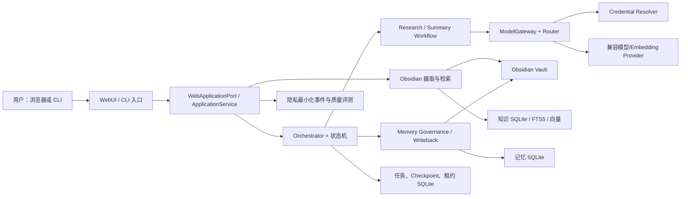
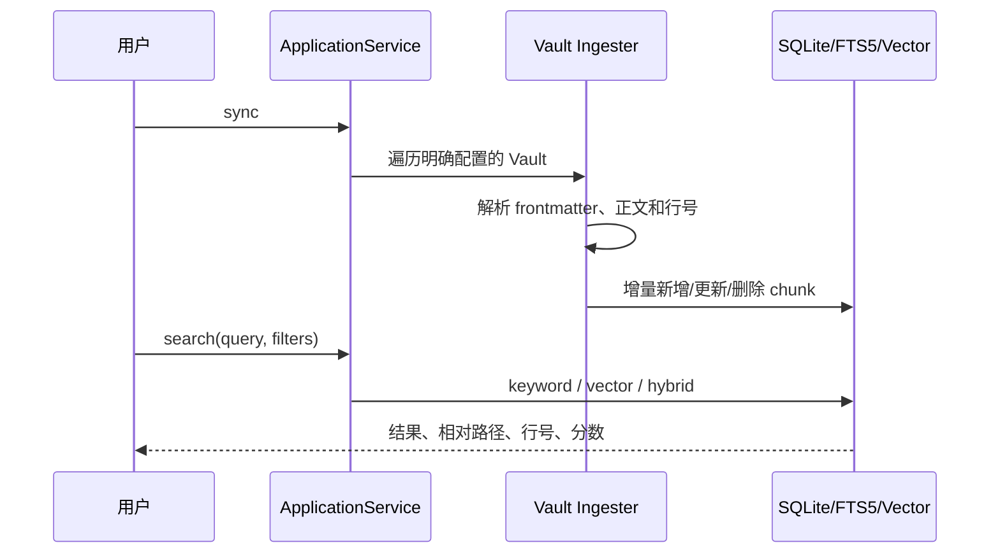
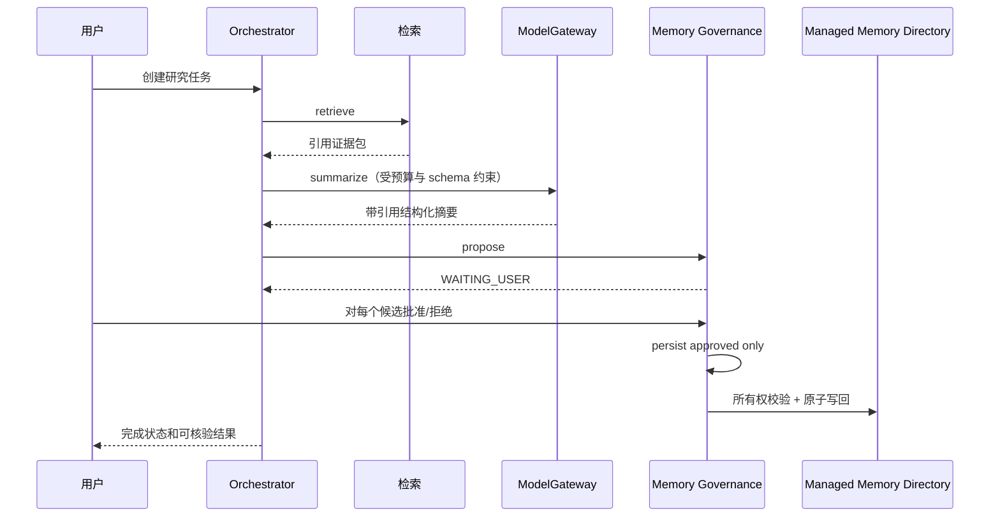
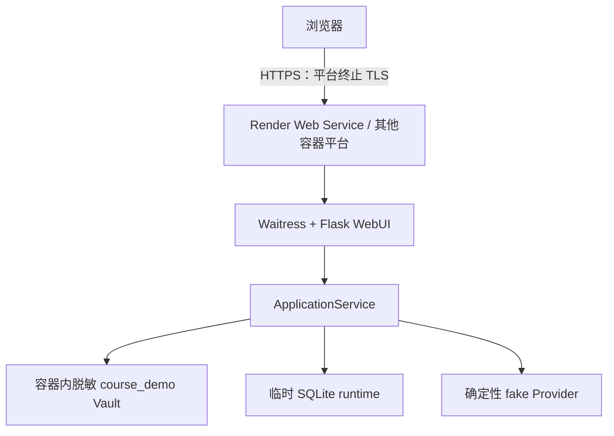

# Personal AI Knowledge Agent 最终架构说明

状态：课程交付架构快照  
日期：2026-08-14

## 定位与边界

本项目是包含受治理 Agent Workflow 的 B 类应用。它为个人 Obsidian 知识库提供增量摄取、可引用检索、研究摘要、记忆审批和受控写回。

“Agent”能力被刻意限定：应用创建固定的 `retrieve → summarize → propose → persist → writeback` 计划；模型只在受约束的摘要步骤中推理，不能动态改写计划、自由选择工具或绕过审批。自研运行时负责依赖调度、状态转换、预算、重试、Checkpoint、租约、取消和验证，因此移除真实 LLM 后仍能用确定性测试验证治理机制。

公开 WebUI 是单用户课程演示，不是多租户 SaaS。公网部署必须开启 demo mode，只使用脱敏样例和 fake Provider；本地个人模式才允许读取用户明确配置的 Vault 和凭据。

## 组件架构

### 接口层

- `personal_ai_agent.cli`：完整管理和自动化入口；
- `personal_ai_agent.web_server`：Waitress WSGI 启动器；
- `personal_ai_agent.web`：Flask 应用工厂、服务器渲染页面、CSRF 与安全错误映射；
- `WebApplicationPort`：Web 层唯一业务契约，路由不直接访问 Repository、Vault 或 Provider。

### 应用与工作流层

- `ApplicationService` 组合摄取、检索、任务、记忆和评测能力；
- `Orchestrator` 验证计划 DAG 并执行就绪步骤；
- `ResearchWorkflow` 获取证据并建立位置、内容哈希和引用；
- `ResearchSummaryWorkflow` 生成结构化摘要并验证每个段落的引用；
- `MemoryGovernanceWorkflow` 检测敏感、重复和冲突候选，暂停等待人工决策；
- `ObsidianWritebackWorkflow` 只把批准内容写入受管目录。

### 基础设施层

- SQLite Repository 保存知识、向量、任务、Checkpoint、租约、记忆、配额与事件；
- FTS5 提供关键词检索，向量索引与 RRF 提供混合排序；
- `ModelGateway` 处理能力匹配、预算、回退、重试、用量和成本；
- `SQLiteProviderRateLimiter` 跨进程协调请求、Token、并发租约和冷却；
- `CredentialResolver` 在调用时解析系统密钥环或显式环境变量后备。

## 核心数据流

### 知识同步与检索

文件路径先经过 Vault 边界校验；索引保存稳定 ID、内容哈希和引用位置。检索结果必须可回到原文，而不是只返回无出处的生成文本。

### Research、审批与写回

任何引用未知、原文内容漂移、候选未全部决策、写入目标越界或任务租约丢失都会显式失败，不静默继续。

### 凭据解析与 Provider 调用

1. 配置只保存 Provider 元数据和可选 `credential_env` 名称，不保存秘密；
2. 调用发生时先查询 OS keyring 的 `provider:<provider_id>`；
3. keyring 不存在且配置显式允许时，读取对应环境变量；
4. 带凭据远程端点必须是 HTTPS；
5. 通过路由、预算和共享限流后才发送最小必要请求；
6. 日志只记录安全元数据与用量，不记录秘密、Prompt 或 Provider 正文。

## 数据模型与持久化

| 数据域 | 主要实体 | 关键约束 |
|---|---|---|
| 知识 | Vault、Note、Chunk | 相对路径、稳定 ID、内容哈希、行号；增量同步删除陈旧数据 |
| 向量 | KnowledgeEmbedding | Provider/model/dimension 与 chunk 哈希共同决定缓存有效性 |
| 任务 | Task、PlanStep、Artifact | 显式状态机；DAG 无环；预算和错误为结构化数据 |
| 执行 | Checkpoint、ExecutionLease | 单活 owner；过期可接管；丢失租约禁止旧执行者写入 |
| 记忆 | MemoryCandidate、MemoryRecord | 每个候选必须明确决策；敏感内容不能进入持久化 |
| Provider 治理 | RateLimit、Reservation、Cooldown | 请求/Token/并发跨进程共享；实际用量幂等核对 |
| 可观测性 | ObservationEvent | 只存类型、状态、延迟、Token、费用等最小元数据 |
| 质量 | EvaluationReport、BaselineCandidate | 数据集和 schema 版本化；回归门禁按同范围比较 |

默认运行数据位于配置指定的 `data_directory`，与 Vault 分离。公开演示使用实例专属临时 runtime；真实个人 Vault 和运行数据库不应进入 Git、镜像或 CI artifact。

## 信任边界与安全控制

| 边界/威胁 | 控制 |
|---|---|
| Git 仓库 ↔ 本地秘密 | 配置拒绝秘密字段；`.env` 忽略；高置信度工作区和历史扫描 |
| 浏览器 ↔ Web 服务 | CSRF；请求大小限制；安全 Cookie；CSP 等响应头；HTTPS 模式 HSTS；错误脱敏 |
| Web 路由 ↔ 业务层 | 只依赖 `WebApplicationPort`；路由不能直接读文件、数据库或 Provider |
| 应用 ↔ Vault | 路径规范化和边界检查；受管 Memory 目录；所有权标记；原子写入 |
| 应用 ↔ 外部 Provider | keyring 优先；显式环境变量后备；远程凭据只走 HTTPS；预算、超时、重试、限流 |
| 模型输出 ↔ 持久化 | schema 验证、引用验证、敏感检测、重复/冲突检测、人工审批 |
| 并发执行者 ↔ 任务状态 | SQLite 租约和 Checkpoint；失去租约的执行者不能提交新状态 |
| 公开访客 ↔ 课程演示 | 强制 demo mode、固定脱敏 Vault、fake Provider、禁用凭据管理、临时写入 |

本地个人 WebUI 没有账户系统，因此安全前提是仅监听回环地址。反向代理公开部署时必须启用平台 HTTPS、设置长期随机 Web secret，并保持 demo mode；当前架构不允许把个人模式直接公开。

## 部署架构

生产镜像基于 Python 3.12 slim，显式复制源码和课程演示数据，以非 root 用户运行，提供 `/health`。平台通过 `PORT` 注入监听端口，`render.yaml` 生成 Web secret 并开启 HTTPS 安全标志。免费实例的文件系统和休眠行为意味着演示状态不可视为持久数据。

本地 Compose 进一步使用只读根文件系统、tmpfs、命名 runtime 卷、capability drop 和 `no-new-privileges`。个人模式需要把自己的 Vault 和配置作为明确的本地资源提供，凭据首选宿主操作系统密钥环；演示镜像不包含个人数据。

## 可验证性与质量门禁

- `scripts/verify.py` 统一执行测试、编译、CLI、同步、成本与质量烟雾测试；
- `Dockerfile.verify` 从干净 Linux 基础镜像安装并执行相同验收；
- 测试使用 fake Provider、临时 Vault/SQLite 和可注入时钟，不需要付费 API；
- 引用篡改、内容漂移、预算耗尽、租约丢失、CSRF、路径越界、错误泄漏均有负向测试；
- `.gitlab-ci.yml` 包含 `unit-test`、包构建、容器构建和受保护手动部署契约；
- 质量数据集、报告 schema 和基线候选可版本化，回归使用独立退出码。

截至本快照，干净 Linux 镜像与主机环境均通过 225 项测试；加入课程文档契约后应以最新一键验收输出为准。远程 CI、公开 URL 和 PR/MR 仍需真实外部证据才能宣称完成。

## 关键设计取舍

- 选择固定计划而非动态 Planner：降低不可预测性，使审批、恢复和引用校验可证明；
- 选择 SQLite 而非外部数据库：支持本地优先和单命令演示，同时用租约处理多进程协调；
- 选择 Flask/Jinja 而非 SPA：复用 Python 服务边界，减少构建链和浏览器侧秘密风险；
- 选择 Docker 为主分发、Python 包为辅：覆盖课程 WebUI 部署与本地开发；
- 选择 demo mode 而非公开个人模式：项目没有多租户身份系统，不假装已具备 SaaS 安全边界。

