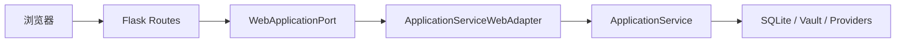

# 课程 WebUI 基础架构

## 1. 技术路线

- Flask 3.1.x；
- Jinja 服务器端渲染；
- Flask application factory；
- Flask test client；
- 现阶段不使用 SPA、Node.js 构建链或浏览器直连 Provider。

Flask 3.1 支持 Python 3.9+，与项目现有支持范围一致。

## 2. 分层边界



规则：

- Flask routes 只依赖 `WebApplicationPort`；
- 生产环境使用 `ApplicationServiceWebAdapter`；
- 测试注入 fake port；
- routes 不创建 Repository；
- routes 不直接读取 Vault；
- routes 不直接调用 Model/Embedding Provider；
- 每个 Flask app 实例保存独立 port，不使用全局业务 service。

## 3. 当前端口方法

`WebApplicationPort` 固定以下业务入口：

- `health()`；
- `knowledge_status()`；
- `search(...)`；
- `run_research(...)`；
- `show_task(...)`；
- `cancel_task(...)`；
- `pending_memory_candidates(...)`；
- `resolve_memory(...)`；
- `observability_summary(...)`。

T6 只开放首页与健康检查。其他方法用于 T7/T8，不代表当前已经存在对应页面。

## 4. 应用工厂

入口：

```python
from personal_ai_agent.web import create_app
```

测试时显式注入：

```python
app = create_app(
    application_port=fake_port,
    test_config={"TESTING": True, "DEMO_MODE": True},
)
```

本地开发使用配置环境变量：

```powershell
$env:PERSONAL_AGENT_CONFIG = "agent.config.json"
python -m flask --app personal_ai_agent.web:create_app run --host 127.0.0.1 --port 8000
```

该命令只用于本地开发。公开部署必须使用 T10 选定的生产 WSGI server，不使用 Flask 内置开发服务器。

## 5. 健康检查

`GET /health` 返回：

```json
{
  "config_loaded": true,
  "demo_mode": false,
  "status": "ok",
  "storage_ready": true
}
```

健康检查只调用 Application Service 的公开配置/本地存储验证，不调用模型或 Embedding Provider，不要求 key，也不产生付费请求。

## 6. 当前页面

`GET /`：

- 在 30 秒内说明项目价值；
- 展示 Vault ID 和全文检索可用状态；
- demo mode 下明确标注脱敏数据与确定性模型边界。

`GET /missing` 等未知页面：返回安全中文 404，不显示内部路径。

未分类异常：

- `/health` 或 JSON 请求返回 `internal_error` 和随机关联 ID；
- HTML 请求显示通用错误页和关联 ID；
- 不返回堆栈、绝对路径、Prompt、Provider 正文或凭据。

## 7. 延后到 T7–T9 的内容

- 搜索表单与结果；
- Research、Task 和 Memory 审批页面；
- CSRF；
- CSP 和其他安全响应头；
- 请求大小限制；
- 安全 Cookie；
- 完整错误分类映射；
- 统一样式与进一步可访问性验收。

T6 的安全错误边界不是对 T9 的替代。
